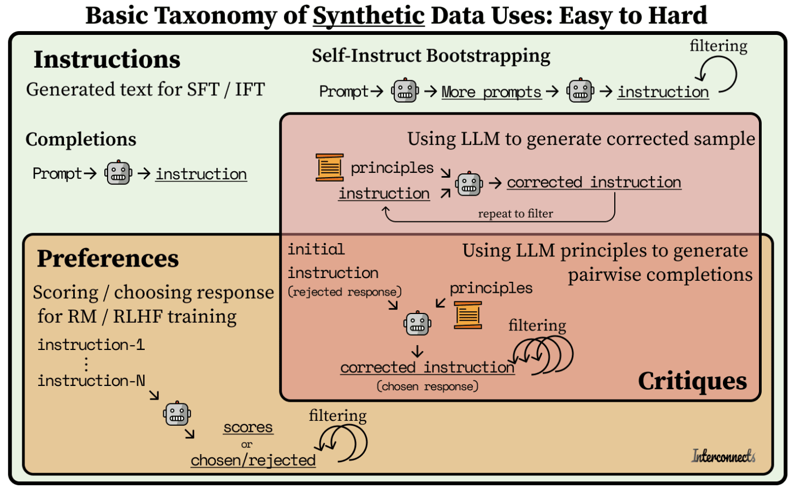

# 合成数据集

合成数据是人工生成的数据，用于模拟现实世界中的真实情况。它能够通过扩充或强化数据集，克服数据方面的局限。尽管合成数据此前已在某些应用场景中有所运用，但大语言模型使得合成数据集在语言模型的预训练、后训练以及评估过程中变得更为流行。

我们将使用 [`distilabel`](https://distilabel.argilla.io/latest/)，这是一个为工程师提供合成数据和人工智能反馈的框架。如果需要基于经验证的研究论文来构建快速、可靠且可扩展的流程，该框架十分适用。如果你想深入了解该框架并学习最佳实践，你可以阅读[官方文档](https://distilabel.argilla.io/latest/)。

## 章节概览

语言模型领域的合成数据可以分为三类：指令（instructions）、偏好（preferences）和评论（critiques）。我们将重点关注前两类，因为它们涉及为指令微调和偏好对齐生成人工数据。在学习这两类的同时，我们也会涉及第三类某些方面的内容，因为这关乎借助模型评论和重写，来提升现有数据的质量。

## 内容目录

### 1. [指令数据集](./instruction_datasets_cn.md)

你将学习如何为指令微调（instruction tuning）生成指令数据集，这包括基本的提示语方式以及最近论文提出的更精细的方式。这里面，通过上下文学习并借助种子数据来生成指令微调数据集的方法包括 SelfInstruct 和 Magpie；进化改进指令微调数据的方法包括 EvolInstruct。你可以点击[这里](./instruction_datasets_cn.md)开始学习。

### 2. [偏好数据集](./preference_datasets_cn.md)

你讲学习如何为偏好对齐（preference alignment）去生成偏好数据集。我们将在上一节的基础上，额外生成别的回答。接下来，我们还会学习如何通过 EvolQuality 来优化这些回答。最终，我们会学习如何用 UltraFeedback 生成分数和评论，来评估这些回答，以此来获取偏好数据对。你可以点击[这里](./preference_datasets_cn.md)开始学习。

### Exercise Notebooks

| 标题 | 概述 | 练习 | 链接 | Colab |
|-------|-------------|----------|------|-------|
| 指令微调数据集 | 为指令微调生成数据集 | 🐢 为指令微调生成数据集   🐕 借助种子数据为指令微调生成数据集   🦁 借助种子数据和 EvolInstruct 为指令微调生成数据集 | [Link](./notebooks/instruction_sft_dataset_cn.ipynb) | [Colab](https://githubtocolab.com/huggingface/smol-course/tree/main/6_synthetic_datasets/notebooks/instruction_sft_dataset.ipynb) |
| 偏好数据集 | 为偏好对齐生成数据集 | 🐢 为偏好对齐生成数据集   🐕 为偏好对齐生成数据集，对回答进行迭代优化   🦁 为偏好对齐生成数据集，对回答进行迭代优化，并借助对回答的评价 | [Link](./notebooks/preference_alignment_dataset_cn.ipynb) | [Colab](https://githubtocolab.com/huggingface/smol-course/tree/main/6_synthetic_datasets/notebooks/preference_alignment_dataset.ipynb) |

## Resources

- [Distilabel 官方文档](https://distilabel.argilla.io/latest/)
- [Synthetic Data Generator is UI app](https://huggingface.co/blog/synthetic-data-generator)
- [SmolTalk](https://huggingface.co/datasets/HuggingFaceTB/smoltalk)
- [Self-instruct 论文](https://arxiv.org/abs/2212.10560)
- [Evol-Instruct 论文](https://arxiv.org/abs/2304.12244)
- [Magpie 论文](https://arxiv.org/abs/2406.08464)
- [UltraFeedback 论文](https://arxiv.org/abs/2310.01377)
- [Deita 论文](https://arxiv.org/abs/2312.15685)
