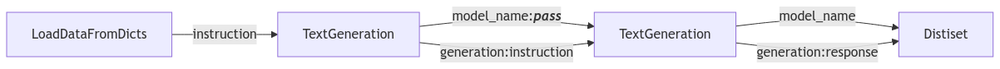

# 合成指令微调数据集

在[指令微调](../1_instruction_tuning/README_CN.md)这一章节，我们学习了通过 SFT 的方法来微调模型。在本文中，我们将学习如何为 SFT 合成指令数据集，这涵盖：使用基本的提示语还生成指令微调数据集，以及使用一些论文中提出的更精细的方法。我们还可以使用种子数据进行上下文学习（in-context learning）来合成数据，相关的方法包括 SelfInstruct 和 Magpie。此外我们还会学习使用 EvolInstruct 来改进现有数据。最后，我们将学习如何使用 `distilabel` 的 `pipeline` 来规范化地进行指令微调数据集的生成。

## 从提示语到数据

合成数据听起来很高级，但它可以简单理解为通过有效的提示语从模型中提取知识来创建数据。反过来，你可以将此视为为特定任务生成数据的一种方式。挑战在于要进行有效提示，同时确保数据具有多样性和代表性。幸运的是，已有许多论文探讨了这个问题，在本文中，我们将研究其中一些有价值的论文。首先，我们将探索如何通过手动地提供提示语来生成合成数据。

### 基本的提示语方式

我们用一个基础的例子开始合成数据的学习。这里我们使用 [HuggingFaceTB/SmolLM2-1.7B-Instruct](https://huggingface.co/HuggingFaceTB/SmolLM2-1.7B-Instruct) 模型，并使用 `distilabel` 中已经集成的 `transformers` 库来载入这个模型。在示例中，我们用 `TextGeneration` 类来生成一个 `prompt` 并基于此再生成 `completion`，这样一个问答就生成完毕了。

首先，通过 `distilabel` 库来加载模型：

```python
from distilabel.llms import TransformersLLM
from distilabel.steps.tasks import TextGeneration

llm = TransformersLLM(model="HuggingFaceTB/SmolLM2-1.7B-Instruct")
gen = TextGeneration(llm=llm)
gen.load()
```

!!! 注意
    `distilabel` 会把 `llm` 加载进内存。当我们在一个 notebook 中跑该代码时，我们还需要在结束时执行 `gen.unload()` 来防止内存持续占用。

接下来，我们开始用 `llm` 来生成一个 `prompt` 作为问题。

```python
next(gen.process([{"instruction": "Generate a questions about the Hugging Face Smol-Course on small AI models."}]))
# What is the purpose of Smol-Course?
```

最后，用 `prompt` 作为问题输入，来生成一个 `completion` 作为回答。

```python
next(gen.process([{"instruction": "What is the purpose of Smol-Course?"}]))
# The Smol-Course is a platform designed to learning computer science concepts.
```

这样我们就得到了一个 `prompt` 和一个对应的 `completion`。重复这一简单步骤，就可以得到更多的类似数据。然而，这些数据的质量并不高，且没有考虑到不同任务领域的微妙差别。此外，重复这个过程使得我们的数据集缺乏多样性。不过，我们有办法解决这个问题。

### SelfInstruct

SelfInstruct 基于一个种子数据集生成新的指令数据。一条种子数据可以是一个单一的指令或者一段上下文。该过程通常从一系列初始的种子数据开始。然后语言模型被要求基于种子数据进行上下文学习，针对上下文提出新的问题。在 [distilabel 中的模板](https://github.com/argilla-io/distilabel/blob/main/src/distilabel/steps/tasks/templates/self-instruct.jinja2) 中包含了要求模型执行这一任务的提示语，大致是这样：

```
# Task Description
Develop {{ num_instructions }} user queries that can be received by the given AI application and applicable to the provided context. Emphasize diversity in verbs and linguistic structures within the model's textual capabilities.

# Context
{{ input }}

# Output
```

具体到代码实现上，我们首先要将 `llm` 传入 [SelfInstruct](https://distilabel.argilla.io/dev/components-gallery/tasks/selfinstruct/) 这个类的构造函数。这里我们假设用一段描述如何合成人工数据集的英文文字（就是代码中的`text`）作为上下文，来生成新的指令：

```python
from distilabel.steps.tasks import SelfInstruct

self_instruct = SelfInstruct(llm=llm)
self_instruct.load()

text = "..."

next(self_instruct.process([{"input": text}]))["instructions"][0]
# What is the process of generating synthetic data through manual prompting?
```

这样生成的指令数据会好很多，且符合我们的实际任务领域。不过，我们还可以做得更好，方法是通过不断进化改进提示语。

### EvolInstruct

EvolInstruct 是一种提示语技术，它以已有的指令数据作为输入，不断改进，使得原数据进化成为更好的版本。这里，“更好”是因为我们对数据生成过程添加了新的标准和限制条件，且进行了深化、具体化、推理或复杂化处理。该过程可以重复多次，针对相同的指令数据生成不同的进化版本，获取比原始数据更好的数据。相关的系统提示语[在 distilabel 中也有实现](https://github.com/argilla-io/distilabel/tree/main/src/distilabel/steps/tasks/evol_instruct)，大致是这样：

```
I want you act as a Prompt Rewriter.
Given prompt a prompt, rewrite it into a more complex version.
Complicate the prompt based on the following criteria:
{{ criteria }}

# Prompt
{{ input }}

# Output
```

具体到代码实现上，我们首先要将 `llm` 传入 [SelfInstruct](https://distilabel.argilla.io/dev/components-gallery/tasks/evolinstruct/) 这个类的构造函数。这里我们使用在 [SelfInstruct](#selfinstruct) 这一小节生成的 `prompt` 来作为输入（就是代码中的 `text`），利用它得到一个进化过的版本。本示例中我们只进化一次：

```python
from distilabel.steps.tasks import EvolInstruct

evol_instruct = EvolInstruct(llm=llm, num_evolutions=1)
evol_instruct.load()

text = "What is the process of generating synthetic data through manual prompting"

next(evol_instruct.process([{"instruction": text}]))
# What is the process of generating synthetic data through manual prompting?
# And, how does the artificial intelligence system, GPT4, use machine learning algorithms to manipulate the input data into synthetic data?
```

经过进化，指令数据变得更复杂了，不过也丧失了一些原有数据的信息。所以我们也要知道，该方法也是一个双刃剑，我们需要对进化过的数据的质量格外关注。

### Magpie

Magpie 技术利用了语言模型自回归的特性以及前面学习到过的[聊天模板](../1_instruction_tuning/chat_templates_cn.md)。由于聊天模板在指令微调过程中为对话设定了固定的格式，清晰指出了话语是哪个角色说出来的（系统、用户、助手），在预测过程中，模型的输出也会遵循这个格式去走。这正是 Magpie 所利用的点。一开始，Magpie 直接输入给大语言模型一个聊天模板，但这个聊天模板只包含系统信息，结束于用户开始提问的地方（例如在 `<|im_start|>user\n` 这里结束）。然后利用大语言模型的自回归特性，模型会自己不停输出文本，直到输出了助手回答结束符那里（比如输出到 `<|im_end|>` 终止）。这样一段完整的聊天模板就生成了。这种方法可以让我们高效生成数据，并可以扩展到多轮对话情况。很多人也认为这个方法是可以让大语言模型吐出自己指令微调时的训练数据的。

聊天模板因不同的大语言模型而异，这里我们可以通过下面一个简单的模板，来了解这一技术的具体做法。

```bash
# Step 1: provide the pre-query-prompt
<|im_start|>user\n

# Step 2: the language model generates the user prompt
<|im_start|>user\n
What is the purpose of Smol-Course?

# Step 3: stop the generation
<|im_end|>
```

具体到代码实现上，我们首先要将 `llm` 传入 [Magpie class](https://distilabel.argilla.io/dev/components-gallery/tasks/magpie/) 这个类的构造函数。

```python
from distilabel.steps.tasks import Magpie

magpie = Magpie(llm=llm)
magpie.load()

next(magpie.process([{"system_prompt": "You are a helpful assistant."}]))
# [{
#   "role": "user",
#   "content": "Can you provide me with a list of the top 3 universities?"
# },
# {
#   "role": "assistant",
#   "content": "The top 3 universities are: MIT, Yale, Stanford."
# }]
```

通过上述代码，我们可以马上生成一个包含 `prompt` 和 `completion` 的数据集。但如果我们想在特定领域提升数据质量，我们还可以在 `system_prompt` 加入额外的上下文信息。这样可以使得大语言模型在生成数据时，知道用户会接下来问什么问题。具体来说，特定领域信息加在系统提示语中，多多少少可以让模型产出的数据更偏向这一领域。

```
You're an AI assistant that will help users solving math problems.
```

例如我们应该按上述方法添加系统信息的内容，而不是下面这种写法。

```
You're an AI assistant that generates math problems
```

但总的来说，在训练时，语言模型一般也较少使用包含上下文信息的 `system_prompt`，所以这个方法在自定义情形下也并不是都适用。


### 从 Prompts 到 Pipelines

上面的技术都是通过 `distilabel` 里特定的类去实现的。但为了更规范，我们还可以用  `distilabel` 里的 `Pipeline` 生成数据集。在下面的例子中，我们将使用 `Pipeline` 来为指令为题生成数据集。这个 `Pipeline` 包含 `LoadDataFromDicts` 用以载入种子数据，以及 `TextGeneration` 用以生成 `prompt` 和 `completion`。从种子数据到问题（`prompt`）再到回答（`completion`）的流程，可以用 `>>` 这个运算符串联起来。

```python
from distilabel.llms import TransformersLLM
from distilabel.pipeline import Pipeline
from distilabel.steps import LoadDataFromDicts
from distilabel.steps.tasks import TextGeneration

with Pipeline() as pipeline:
    data = LoadDataFromDicts(data=[{"instruction": "Generate a short question about the Hugging Face Smol-Course."}])
    llm = TransformersLLM(model="HuggingFaceTB/SmolLM2-1.7B-Instruct")
    gen_a = TextGeneration(llm=llm, output_mappings={"generation": "instruction"})
    gen_b = TextGeneration(llm=llm, output_mappings={"generation": "response"})
    data >> gen_a >> gen_b

if __name__ == "__main__":
    distiset = pipeline.run(use_cache=False)
    print(distiset["default"]["train"][0])
# [{
#   "instruction": "What is the purpose of Smol-Course?",
#   "response": "The Smol-Course is a platform designed to learning computer science concepts."
# }]
```

在 pipeline 的内部，其实也有很多好用的功能。它可以自动缓存生成结果，所以有些时候我们可以不去重新跑生成步骤。它也有容错机制，某一步生成失败了，也会继续跑。此外，pipeline 的数据生成是并行运行，所以速度也快。我们还可以用 `draw` 方法对 pipeline 进行可视化。下图就展示了数据流的走向，也展示了 `output_mappings` 是如何将当前环节的输出作为输入送给下一环节的。



## 最佳实践

- 需要确保你的种子数据足够多样，来覆盖足够多的对话场景
- 定时检查数据集，确保生成的数据足够多样、质量足够好
- 对系统提示词进行优化，可以改善生成数据的质量

## 接下来

👨🏽‍💻 代码 - 通过[练习](./notebooks/instruction_sft_dataset_cn.ipynb)生成一个指令微调的数据集
🧑‍🏫 阅读 - 学习[合成偏好数据集](./preference_datasets.md)部分

## References

- [Distilabel 官方文档](https://distilabel.argilla.io/latest/)
- [Self-instruct 论文](https://arxiv.org/abs/2212.10560)
- [Evol-Instruct 论文](https://arxiv.org/abs/2304.12244)
- [Magpie 论文](https://arxiv.org/abs/2406.08464)