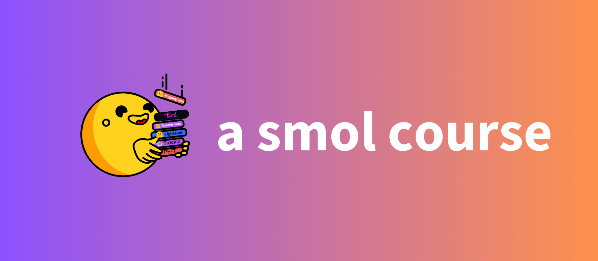

# 关于 smol 的课程

本课程是一个实践性课程，重点关注如何调整大语言模型，使其对齐到特定领域或任务中。对齐大语言模型到特定领域非常易于实操，因为其中的绝大部分工作都可以在本地机器上完成，需要的 GPU 成本非常低。本课程将使用 [SmolLM2](https://github.com/huggingface/smollm/tree/main) 系列的模型，但相关技能对于其它大语言模型同样适用。

<a href="http://hf.co/join/discord">

</a>

<div style="background: linear-gradient(to right, #e0f7fa, #e1bee7, orange); padding: 20px; border-radius: 5px; margin-bottom: 20px; color: purple;">
    <h2>欢迎参与！</h2>
    <p>本课程完全免费开放，并已经过同行评审。你可以通过 <strong> pull request </strong> 参与课程，并提交你的成果。具体步骤如下：</p>
    <ol>
        <li>在 <a href="https://github.com/huggingface/smol-course/fork">这里</a> fork 一下代码仓库 </li>
        <li>阅读学习材料，完成练习，提交你的成果。</li>
        <li>向 december_2024 分支上提出 PR</li>
        <li>等待 PR 通过</li>
    </ol>
    <p>希望这些学习步骤能够帮助到你，我们也期待看到你在社区的贡献</p>
</div>

在 GitHub 代码仓库的 [discussion](https://github.com/huggingface/smol-course/discussions/2#discussion-7602932) 部分有我们的英文讨论区。

## 课程列表

本课程旨在提供实操性指导，借助 smol 系列小模型作为示例，涵盖从最初的训练到生产部署的大部分技能。


| 模块 | 简介 | 状态 | 发布日期  |
|--------|-------------|---------|--------------|
| [Instruction Tuning](./1_instruction_tuning) | Learn supervised fine-tuning, chat templating, and basic instruction following | ✅ Ready | Dec 3, 2024 |
| [Preference Alignment](./2_preference_alignment) | Explore DPO and ORPO techniques for aligning models with human preferences | ✅ Ready  | Dec 6, 2024 |
| [Parameter-efficient Fine-tuning](./3_parameter_efficient_finetuning) | Learn LoRA, prompt tuning, and efficient adaptation methods | ✅ Ready | Dec 9, 2024 |
| [Evaluation](./4_evaluation) | Use automatic benchmarks and create custom domain evaluations | ✅ Ready | Dec 13, 2024 |
| [Vision-language Models](./5_vision_language_models) | Adapt multimodal models for vision-language tasks | ✅ Ready | Dec 16, 2024 |
| [Synthetic Datasets](./6_synthetic_datasets) | Create and validate synthetic datasets for training | ✅ Ready | Dec 20, 2024 |
| [Inference](./7_inference) | Infer with models efficiently | ✅ Ready | Jan 8, 2025 |
| [Agents](./8_agents) | Build your own agentic AI | ✅ Ready | Jan 13, 2025 ||

## 为什么要使用小语言模型？

虽然超大参数量的语言模型性能出众，但它们需要的计算资源过大，不利于实际生产环境的部署应用。相比而言，小模型则在针对特定场景的应用层面有着不少优势：

- **高效性**：训练和部署需要的计算资源少
- **定制化**：方便微调，便于针对特定领域进行改进
- **可控性**：有利于理解和控制模型的行为
- **低成本**：训练和推理成本低
- **隐私性**：可以本地运行，无需借助 API 传输个人数据
- **更环保**：倡导充分利用计算资源、减少碳排放
- **更易于科研发展**：不受人力物力层面的限制，为 LLM 的研究提供了一个更好出发点

## 准备工作

开始课程前，请确保以下几点：

- 你不是机器学习和自然语言处理领域的小白
- 你能够使用 Python、PyTorch 以及 `transformers` 代码库
- 你能够获得到一个预训练过的语言模型，以及有标注的数据集

## 安装

你可以通过一个软件包管理器安装必要的库。我们建议使用 [uv](https://github.com/astral-sh/uv)，当然 `pip` 或 `pdm` 也是可以的。

### 使用 `uv`

目前所有教程内示例已经在 python 3.11 下跑通。如果你已经安装了 `uv`，你可以这样：

```bash
uv venv --python 3.11.0
uv sync
```

### 使用 `pip`

先创建一个 **python 3.11** 的环境，然后这样安装：

```bash
# python -m venv .venv
# source .venv/bin/activate
pip install -r requirements.txt
```
所需要的偏底层的库也都列入了 `requirements.txt` 里，将会被自动安装。

### Google Colab

如果使用 **Google Colab**，其底层库需要根据机器硬件自行决定，所以直接这样就行:

```bash
pip install -r transformers trl datasets huggingface_hub
```

## 再次表示欢迎

期待大家参与！让更多人在无需昂贵计算资源的情况下学习微调大语言模型。


[](https://star-history.com/#huggingface/smol-course&Date)
