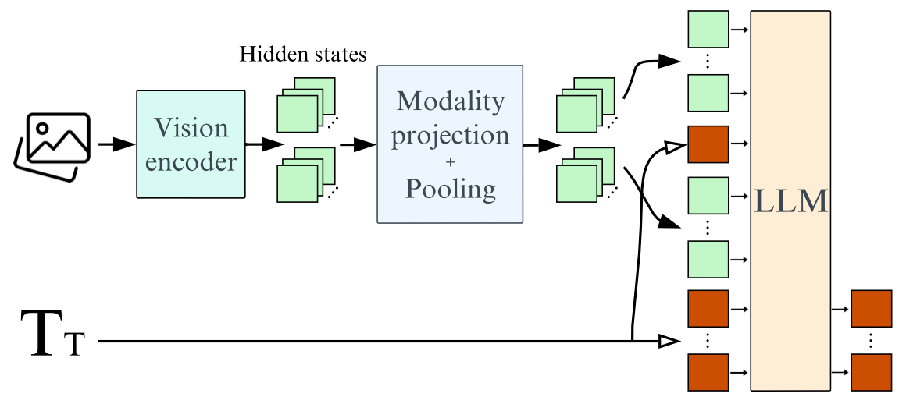
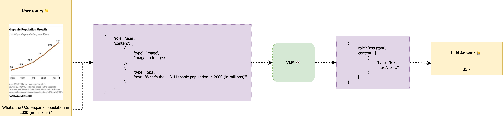
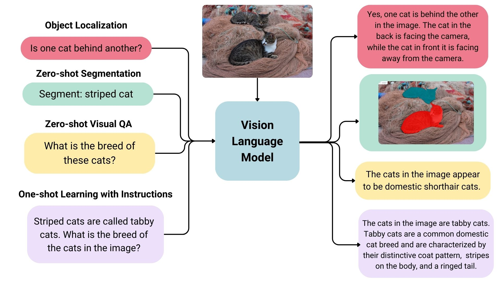

# Modelos de Lenguaje Visual

Los Modelos de Lenguaje Visual (VLMs) cierran la brecha entre imágenes y texto, permitiendo tareas avanzadas como generar descripciones de imágenes, responder preguntas basadas en elementos visuales o entender la relación entre los datos textuales y visuales. Su arquitectura está diseñada para procesar ambas modalidades sin problemas.

### Arquitectura

Los VLMs combinan componentes de procesamiento de imágenes con modelos de generación de texto para lograr una comprensión unificada. Los elementos principales de su arquitectura son:



- **Codificador de Imágenes**: Transforma las imágenes crudas en representaciones numéricas compactas. Se suelen usar codificadores preentrenados como CLIP o transformadores de visión (ViT).
- **Proyector de Embeddings**: Mapea las características de la imagen en un espacio compatible con los embeddings textuales, generalmente usando capas densas o transformaciones lineales.
- **Decodificador de Texto**: Actúa como el componente de generación de lenguaje, traduciendo la información multimodal fusionada en texto coherente. Ejemplos incluyen modelos generativos como Llama o Vicuna.
- **Proyector Multimodal**: Proporciona una capa adicional para combinar las representaciones de imagen y texto. Es crucial para modelos como LLaVA para establecer conexiones más fuertes entre las dos modalidades.

La mayoría de los VLMs aprovechan codificadores de imágenes y decodificadores de texto preentrenados y los alinean mediante un ajuste adicional en conjuntos de datos emparejados de imágenes y textos. Este enfoque hace que el entrenamiento sea eficiente, mientras permite que los modelos generalicen de manera efectiva.

### Uso



Los VLMs se aplican a una variedad de tareas multimodales. Su adaptabilidad les permite desempeñarse en diversos dominios con distintos niveles de ajuste fino:

- **Generación de descripciones de imágenes**: Generar descripciones para imágenes.
- **Respuestas a preguntas visuales (VQA)**: Responder preguntas sobre el contenido de una imagen.
- **Búsqueda cruzada modal**: Encontrar texto correspondiente a una imagen dada o viceversa.
- **Aplicaciones creativas**: Asistir en diseño, generación de arte o creación de contenido multimedia atractivo.



El entrenamiento y fine-tuning de los VLMs dependen de conjuntos de datos de alta calidad que emparejan imágenes con anotaciones textuales. Herramientas como la biblioteca `transformers` de Hugging Face proporcionan acceso conveniente a VLMs preentrenados y flujos de trabajo optimizados para el fine-tuning personalizado.

### Formato de Chat

Muchos VLMs están estructurados para interactuar de manera similar a un chatbot, mejorando la usabilidad. Este formato incluye:

- Un **mensaje del sistema** que establece el rol o contexto para el modelo, como "Eres un asistente especializado en analizar datos visuales."
- **Consultas del usuario** que combinan entradas de texto e imágenes asociadas.
- **Respuestas del asistente** que proporcionan salidas de texto derivadas del análisis multimodal.

Esta estructura conversacional es intuitiva y se alinea con las expectativas de los usuarios, especialmente para aplicaciones interactivas como servicio al cliente o herramientas educativas.

Aquí tienes un ejemplo de cómo podría verse una entrada formateada:

```json
[
    {
        "role": "system",
        "content": [{"type": "text", "text": "Eres un modelo de Lenguaje Visual especializado en interpretar datos visuales de imágenes de gráficos..."}]
    },
    {
        "role": "user",
        "content": [
            {"type": "image", "image": "<image_data>"},
            {"type": "text", "text": "¿Cuál es el valor más alto en el gráfico de barras?"}
        ]
    },
    {
        "role": "assistant",
        "content": [{"type": "text", "text": "42"}]
    }
]
```

**Trabajando con Múltiples Imágenes y Videos**

Los VLMs también pueden procesar varias imágenes o incluso videos adaptando la estructura de entrada para acomodar entradas visuales secuenciales o paralelas. Para los videos, los fotogramas pueden extraerse y procesarse como imágenes individuales, manteniendo el orden temporal.

## Recursos

- [Blog de Hugging Face: Modelos de Lenguaje Visuales](https://huggingface.co/blog/vlms)
- [Blog de Hugging Face: SmolVLM](https://huggingface.co/blog/smolvlm) 

## Próximos Pasos

⏩ Prueba el notebook [vlm_usage_sample.ipynb](./notebooks/vlm_usage_sample.ipynb) para explorar diferentes usos de SMOLVLM.