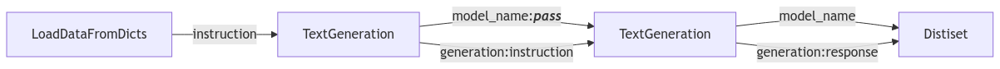

# 인스트럭션 튜닝 데이터셋 생성하기

[인스트럭션 튜닝 챕터](../1_instruction_tuning/README.md)에서 지도 학습 기반 파인튜닝을 통해 모델을 파인튜닝하는 것에 대해 배웠습니다. 이번 섹션에서는 SFT를 위한 인스트럭션 데이터셋을 생성하는 방법을 살펴보겠습니다. 기본적인 프롬프팅을 통해 인스트럭션 튜닝 데이터셋을 생성하고 논문에 나온 보다 정교한 기법을 사용하는 방법을 살펴볼 것입니다. 인스트럭션 튜닝 데이터셋은 인컨텍스트 러닝(in-context learning)을 위한 시드 데이터를 가지고 SelfInstruct와 Magpie와 같은 방법을 통해 생성될 수 있습니다. 또한, EvolInstrct를 통해 인스트럭션 진화를 살펴볼 것입니다. 마지막으로, distilbabel 파이프라인을 사용하여 인스트럭션 튜닝을 위한 데이터셋을 생성하는 방법을 살펴봅니다.

## 프롬프트에서 데이터로

합성 데이터는 거창하게 들리지만, 모델로부터 지식을 추출하기 위한 효과적은 프롬프팅을 통해 데이터를 생성하는 것으로 단순화할 수 있습니다. 다시 말해, 여러분은 이것을 특정 태스크를 위한 데이터를 생성하는 방법이라고 생각할 수 있습니다. 문제는 데이터가 다양하고 대표성을 갖도록 보장하면서 효과적으로 프롬프팅하는 것입니다. 다행히도 많은 논문들이 이러한 문제를 탐구해 왔으며, 이번 강좌에서 유용한 몇 가지 논문을 살펴보겠습니다. 먼저 수동 프롬프팅을 통해 합성 데이터를 생성하는 방법을 살펴볼 것입니다.

### 기본적인 프롬프팅

기본 예제부터 시작하여 `distilabel` 라이브러리의 `transformers` 통합을 사용하여 [HuggingFaceTB/SmolLM2-1.7B-Instruct](https://huggingface.co/HuggingFaceTB/SmolLM2-1.7B-Instruct) 모델을 로드하겠습니다. `TextGeneration` 클래스를 사용하여 합성 `prompt`를 생성하고 이를 사용하여 `completion`을 생성하겠습니다.

다음으로 `distilabel` 라이브러리를 사용하여 모델을 로드합니다.

```python
from distilabel.llms import TransformersLLM
from distilabel.steps.tasks import TextGeneration

llm = TransformersLLM(model="HuggingFaceTB/SmolLM2-1.7B-Instruct")
gen = TextGeneration(llm=llm)
gen.load()
```

> **Note**
> Distilabel은 `llm`을 메모리에 로드하므로 노트북에서 작업할 때는 메모리 문제를 피하기 위해 작업을 맞친 후 `gen.unload()`를 실행해야 합니다.

이제 `llm`을 사용하여 인스트럭션 튜닝을 위한 `prompt`를 생성하겠습니다.

```python
next(gen.process([{"instruction": "Generate a questions about the Hugging Face Smol-Course on small AI models."}]))
# What is the purpose of Smol-Course?
```

마지막으로 동일한 `prompt`를 입력으로 사용하여 `completion`을 생성할 수 있습니다.


```python
next(gen.process([{"instruction": "What is the purpose of Smol-Course?"}]))
# The Smol-Course is a platform designed to learning computer science concepts.
```

멋지네요! 합성 `prompt`와 그에 상응하는 `completion`을 생성할 수 있습니다. 이러한 간단한 접근 방식을 대규모로 재사용하면 훨씬 더 많은 데이터셋을 생성할 수 있지만 데이터 품질이 그렇게 좋지 않고 강좌나 도메인의 뉘앙스를 고려하지 않습니다. 또한 현재 코드를 다시 실행하면 데이터가 그다지 다양하지 않다는 것을 볼 수 있습니다. 다행히도 이 문제를 해결하는 방법이 있습니다.

### SelfInstruct

SelfInstruct는 시드 데이터셋을 기반으로 새로운 인스트럭션을 생성하는 프롬프트입니다. 이러한 시드 데이터는 단일 인스트럭션 또는 컨텍스트의 일부일 수 있습니다. 그 과정은 초기 시드 데이터 풀을 통해 시작됩니다. 언어 모델은 이후에 인컨텍스트 러닝을 사용하여 이러한 시드 데이터를 기반으로 새로운 인스트럭션을 생성하도록 프롬프팅됩니다. 이 프롬프트는 [distilabel에 구현](https://github.com/argilla-io/distilabel/blob/main/src/distilabel/steps/tasks/templates/self-instruct.jinja2)되어 있으며 단순화된 버전은 아래와 같습니다:

```
# Task Description
Develop {{ num_instructions }} user queries that can be received by the given AI application and applicable to the provided context. Emphasize diversity in verbs and linguistic structures within the model's textual capabilities.

# Context
{{ input }}

# Output
```

이를 사용하기 위해서는 `llm`을 [SelfInstruct 클래스](https://distilabel.argilla.io/dev/components-gallery/tasks/selfinstruct/)에 전달해야 합니다. [프롬프트에서 데이터로 섹션](#프롬프트에서-데이터로)의 텍스트를 컨텍스트로 사용하여 새 인스트럭션을 생성해 보겠습니다.

```python
from distilabel.steps.tasks import SelfInstruct

self_instruct = SelfInstruct(llm=llm)
self_instruct.load()

context = "<prompt_to_data_section>"

next(self_instruct.process([{"input": text}]))["instructions"][0]
# What is the process of generating synthetic data through manual prompting?
```

생성된 인스트럭션은 이미 훨씬 개선되었으며 실제 내용과 도멘이에 잘 맞습니다. 그러나 진화를 통해 프롬프트를 개선하면 훨씬 더 좋은 결과를 얻을 수 있습니다.

### EvolInstruct

EvolInstruct는 입력 인스트럭션을 받아 그것을 더 나은 버전의 동일한 인스트럭션으로 발전시키는 프롬프팅 기법입니다. 이러한 더 나은 버전은 일련의 기준에 따라 정의되며 원래의 인스트럭션에 제약 조건, 심화, 구체화, 추론 혹은 복잡성을 추가합니다. 이 과정은 동일한 인스트럭션의 다양한 진화를 만들기 위해 여러번 반복될 수 있으며, 이상적으로 원래의 인스트럭션의 더 나은 버전으로 이어질 수 있습니다. 프롬프트는 [distilabel에 구현](https://github.com/argilla-io/distilabel/tree/main/src/distilabel/steps/tasks/evol_instruct)되어 있으며 단순화된 버전은 아래와 같습니다:


```
I want you act as a Prompt Rewriter.
Given prompt a prompt, rewrite it into a more complex version.
Complicate the prompt based on the following criteria:
{{ criteria }}

# Prompt
{{ input }}

# Output
```

이를 사용하기 위해서는 `llm`을 [EvolInstruct 클래스](https://distilabel.argilla.io/dev/components-gallery/tasks/evolinstruct/)에 전달해야 합니다. [SelfInstruct 섹션](#selfinstruct)의 합성 프롬프트를 입력으로 사용하여 더 나은 버전으로 진화시켜 보겠습니다. 이 예시에서는 한 번의 생성을 통해 진화하였습니다.

```python
from distilabel.steps.tasks import EvolInstruct

evol_instruct = EvolInstruct(llm=llm, num_evolutions=1)
evol_instruct.load()

text = "What is the process of generating synthetic data through manual prompting"

next(evol_instruct.process([{"instruction": text}]))
# What is the process of generating synthetic data through manual prompting?
# And, how does the artificial intelligence system, GPT4, use machine learning algorithms to manipulate the input data into synthetic data?
```

인스트럭션은 이제 더 복잡해졌지만 원래의 의미를 일부 잃었습니다. 그래서 진화는 양날의 검이 될 수 있으며 생성하는 데이터의 품질에 주의를 기울여야 한다는 것을 고려해야 합니다.

### Magpie

Magpies는 언어 모델의 자동 회귀적 요소와 인스트럭션 튜닝 과정 동안 사용된 [채팅 템플릿](../1_instruction_tuning/chat_templates.md)에 의존하는 기법입니다. 여러분도 기억하시겠지만, 채팅 템플릿은 명확한 역할 표시 (시스템, 유저, 어시스턴트)를 통해 대화를 구조화하는 형식입니다. 인스트럭션 튜닝 단계에서 언어 모델은 이러한 형식을 재현하도록 채적화되었으며, 바로 이 점을 magpie가 활용하고 있습니다. magpie는 채팅 템플릿에 기반한 사전 쿼리 프롬프트로 시작하지만 유저 메세지 표시(예: <|im_start|>user\n) 앞에서 멈추고, 그 이후에 언어 모델을 사용하여 어시스턴트 표시 (예: <|im_end>)가 끝날 때까지 사용자 프롬프트를 생성합니다. 이 접근 방식은 매우 효율적인 방식으로 많은 양의 데이터를 생성할 수 있으며 멀티턴 대화로 확장될 수 있습니다. 이렇게 생성된 데이터는 사용된 모델의 인스터럭션 튜닝 단계에서 학습 데이터를 재현한다는 가설을 세웁니다.

이 시나리오에서 프롬프트 템플릿은 채팅 템플릿 형식을 기반으로 하기 때문에 모델마다 다릅니다. 그러나 우리는 단순화된 버전의 과정을 단계별로 살펴볼 수 있습니다.

```bash
# Step 1: provide the pre-query-prompt
<|im_start|>user\n

# Step 2: the language model generates the user prompt
<|im_start|>user\n
What is the purpose of Smol-Course?

# Step 3: stop the generation
<|im_end|>
```

distilabel에서 사용하려면 [Magpie 클래스](https://distilabel.argilla.io/dev/components-gallery/tasks/magpie/)에 `llm`을 전달해야 합니다.

```python
from distilabel.steps.tasks import Magpie

magpie = Magpie(llm=llm)
magpie.load()

next(magpie.process([{"system_prompt": "You are a helpful assistant."}]))
# [{
#   "role": "user",
#   "content": "Can you provide me with a list of the top 3 universities?"
# },
# {
#   "role": "assistant",
#   "content": "The top 3 universities are: MIT, Yale, Stanford."
# }]
```


우리는 바로 `prompt`와 `completion`을 포함한 데이터셋을 얻습니다. 자체 도메인에서의 성능을 개선하기 위해서는 추가 컨텍스트를 `system_prompt`에 주입할 수 있습니다. LLM이 Magpie와 함께 특정 도메인의 데이터셋을 생성하도록 하려면, 시스템 프롬프트에 사용자 쿼리가 무엇인지 설명하는 것이 도움이 됩니다. 이후에 사용자 프롬프트 생성을 시작하기 전에 사전 쿼리 프롬프트에서 이것을 사용하여 해당 도메인의 사용자 쿼리를 생성하도록 LLM에 편향성을 부여합니다.

```
You're an AI assistant that will help users solving math problems.
```

다음과 같이 시스템 프롬프트는 대신에 위와 같이 작성하는 것이 중요합니다:

```
You're an AI assistant that generates math problems
```

일반적으로 언어 모델은 `system_prompt`에 추가 컨텍스트를 전달하는 데 덜 최적화되어 있으므로 다른 기술처럼 사용자 지정에 항상 잘 동작하지는 않습니다.

### 프롬프트에서 파이프라인으로

지금까지 살펴본 클래스는 모두 파이프랑ㄴ이세ㅓ 사용할 수 있는 독립적인 클래스입니다. 이것은 좋은 시작이지만, `Pipeline` 클래스를 사용하여 데이터셋을 생성함으로써 훨씬 더 나은 작업을 수행할 수 있습니다. `TextGeneration` 단계를 사용하여 인스트럭션 튜닝을 위한 합성 데이터셋을 생성해 보겠습니다. 파이프라인은 데이터를 로드하는 `LoadDataFromDicts` 단계, `prompt`를 생성하는 `TextGeneration` 단계, 그리고 그 프롬프트에 대한 `completion`으로 구성됩니다. 이 단계들을 연결하고 `>>` 연산자를 사용하여 파이프라인을 통해 데이터를 흐르게 할 것입니다. [distilabel 문서](https://distilabel.argilla.io/dev/components-gallery/tasks/textgeneration/#input-output-columns)에서 단계의 입력과 출력 열을 볼 수 있습니다. 데이터가 파이프라인을 통해 올바르게 흐르도록 하기 위해서 `output_mappings` 파라미터를 사용하여 출력 열을 다음 단계의 입력 열에 매핑합니다.

```python
from distilabel.llms import TransformersLLM
from distilabel.pipeline import Pipeline
from distilabel.steps import LoadDataFromDicts
from distilabel.steps.tasks import TextGeneration

with Pipeline() as pipeline:
    data = LoadDataFromDicts(data=[{"instruction": "Generate a short question about the Hugging Face Smol-Course."}])
    llm = TransformersLLM(model="HuggingFaceTB/SmolLM2-1.7B-Instruct")
    gen_a = TextGeneration(llm=llm, output_mappings={"generation": "instruction"})
    gen_b = TextGeneration(llm=llm, output_mappings={"generation": "response"})
    data >> gen_a >> gen_b

if __name__ == "__main__":
    distiset = pipeline.run(use_cache=False)
    print(distiset["default"]["train"][0])
# [{
#   "instruction": "What is the purpose of Smol-Course?",
#   "response": "The Smol-Course is a platform designed to learning computer science concepts."
# }]
```

내부적으로 이 파이프라인에는 멋진 기능이 많이 있습니다. 생성 결과를 자동으로 캐시하므로 생성 단계를 재실행할 필요가 없습니다. 내결함성이 포함되어 있어 생성 단계가 실패하더라도, 파이프라인은 계속 실행됩니다. 또한 파이프라인은 모든 생성 단계를 병렬로 실행하므로 생성 속도가 더 빠릅니다. `draw` 메소드를 사용하여 파이프라인을 시각화할 수도 있습니다. 여기에서 여러분은 파이프라인을 통해 데이터가 어떻게 흐르는지, 출력 열을 다음 단계의 입력 열에 매핑하는 데 `output_mappings`가 어떻게 사용되는지 확인할 수 있습니다.



## 모범 사례

- 다양한 시나리오를 다루는 다양한 시드 데이터를 확보하세요
- 생성된 데이터가 다양하고 고품질인지 정기적으로 데이터셋을 평가하세요
- 데이터의 품질을 개선하기 위해서 (시스템)프롬프트를 반복하세요

## 다음 단계

👨🏽‍💻 코드 - 인스트럭션 튜닝을 위한 데이터셋을 생성하는 [실습 노트북](./notebooks/instruction_sft_dataset.ipynb)

🧑‍🏫 학습 - [선호도 데이터셋 생성](./preference_datasets.md)에 대하여

## 참고

- [Distilabel Documentation](https://distilabel.argilla.io/latest/)
- [Self-instruct](https://arxiv.org/abs/2212.10560)
- [Evol-Instruct](https://arxiv.org/abs/2304.12244)
- [Magpie](https://arxiv.org/abs/2406.08464)