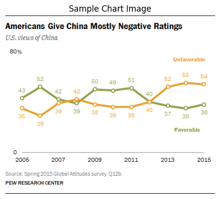

# Practical Exercises

<CourseFloatingBanner chapter={10}
  classNames="absolute z-10 right-0 top-0"
  notebooks={[
    {label: "Google Colab", value: "https://colab.research.google.com/github/huggingface/smol-course/blob/main/notebooks/4/4.ipynb"},
]} />

Welcome to the practical section! Here you’ll put into practice everything you’ve learned about vision language models (VLMs) using **HuggingFaceTB/SmolVLM-Instruct**.  
The exercises progress from foundational concepts to advanced techniques, helping you gain real-world, hands-on experience.

## Learning Objectives

By the end of these exercises, you will be able to:

- Work with a VLM dataset (**HuggingFaceM4/ChartQA**).
- Apply **quantization** and **PEFT** to fine-tune VLMs efficiently.
- Fine-tune **HuggingFaceTB/SmolVLM-Instruct** using both Python APIs and CLI tools.
- Understand **production workflows** for scaling fine-tuning in VLMs.

## Exercise 1: Explore the `SmolVLM-Instruct` Chat Template

**Objective:** Get familiar with the chat formatting and dataset preprocessing required to train and evaluate the model.

### Environment Setup

<Tip warning={true}>

- You need a GPU with at least 8GB VRAM for training. CPU/MPS can run formatting and dataset exploration, but training larger models will likely fail.
- First run will download several GB of model weights; ensure 15GB+ free disk and a stable connection.
- If you need access to private repos, authenticate with Hugging Face Hub via `login()`.

</Tip>

First, install the required libraries: `transformers`, `datasets`, `trl`,`huggingface_hub`, and `trackio`.  
These packages provide the tools for working with the model, datasets, and Hugging Face Hub.  


```bash
# Install required packages (run in Colab or your environment)
pip install transformers datasets trl huggingface_hub trackio
```

### Import dependencies

Now, import the main dependencies we’ll use:
- **torch** for device handling and tensor operations.
- **transformers** classes for loading the model and processor.
- **load_image** utility to fetch and handle images easily.

```python
# Import dependencies

import torch
import os
from transformers import AutoProcessor, AutoModelForImageTextToText, BitsAndBytesConfig
from transformers.image_utils import load_image
```

### Load the model and processor

We select the device (`cuda`, `mps`, or `cpu`) and load the **HuggingFaceTB/SmolVLM-Instruct** model.  
The `AutoProcessor` helps us handle both text and images, formatting them correctly for the model.

```python
device = (
    "cuda"
    if torch.cuda.is_available()
    else "mps" if torch.backends.mps.is_available() else "cpu"
)

# Authenticate with Hugging Face (optional, for private models)
from huggingface_hub import login
# login()  # Uncomment if you need to access private models

model_name = "HuggingFaceTB/SmolVLM-Instruct"
model = AutoModelForImageTextToText.from_pretrained(
    model_name,
    torch_dtype=torch.bfloat16,
).to(device)
processor = AutoProcessor.from_pretrained("HuggingFaceTB/SmolVLM-Instruct")
```

### Explore the dataset

Here we load a small subset of the **ChartQA** dataset (only 1 sample to keep things light).
We then display one of the chart images using matplotlib, so we can visualize the kind of input the model will receive.

```python
from datasets import load_dataset
import matplotlib.pyplot as plt

dataset = load_dataset("HuggingFaceM4/ChartQA")  # just 1 sample
example = dataset['train'][0]
image = load_image(example["image"])

plt.imshow(image)
plt.axis("off")
plt.title("Sample Chart Image")
plt.show()
```



### Build a chat-style prompt

We create a **chat message list** that includes:
- A system instruction.
- A user query along with the image.

Using `processor.apply_chat_template`, we transform this into the exact input format the model expects.

```python
# Define a chat-style prompt
messages = [
    {"role": "system", "content": "You are a helpful assistant that describes images."},
    {"role": "user", "content": [
        {"type": "text", "text": example["query"]},
        {"type": "image", "image": image}
    ]}
]

# Apply the chat template
chat_prompt = processor.apply_chat_template(messages, tokenize=False, add_generation_prompt=True)
print("=== Chat Prompt ===")
print(chat_prompt)
```

<details>
<summary>Output</summary>

```text
=== Chat Prompt ===
<|im_start|>System: <end_of_utterance>
User: Is the value of Favorable 38 in 2015?<image><end_of_utterance>
Assistant:
```

</details>

### Run inference

We tokenize the chat prompt and image into tensors, then generate a response with the model.
Finally, we decode the output tokens back into text.

```python
# Tokenize input
inputs = processor(images=image, text=chat_prompt, return_tensors="pt").to(device)

# Generate model output
with torch.no_grad():
    output = model.generate(**inputs, max_new_tokens=100)

# Decode response
response = processor.decode(output[0], skip_special_tokens=True)
print("=== Model Response ===")
print(response)
```
<details>
<summary>Output</summary>

```text
# Tokenize input
inputs = processor(images=image, text=chat_prompt, return_tensors="pt").to(device)

# Generate model output
with torch.no_grad():
    output = model.generate(**inputs, max_new_tokens=100)

# Decode response
response = processor.decode(output[0], skip_special_tokens=True)
print("=== Model Response ===")
print(response)
```

</details>

Now that we’ve seen how to build prompts and generate responses with **SmolVLM-Instruct**, it’s time to learn how to adapt and **fine-tune** the model efficiently using **LoRA (Low-Rank Adaptation)**. This approach allows training large models with fewer resources and prepares the model for specific downstream tasks.


## Exercise 2: Fine tune the model using LoRA

In this exercise, we’ll apply **LoRA (Low-Rank Adaptation)** to fine-tune our VLM efficiently.
LoRA allows training large models with fewer parameters by injecting trainable low-rank matrices into existing layers.

### Configure LoRA

Here we define a `LoraConfig`:
- `r` and `lora_alpha` control the rank and scaling of the adaptation matrices.
- `target_modules` specifies which parts of the model to adapt.
- `bias` and `task_type` are set for causal language modeling.

We then apply LoRA to the base model using `get_peft_model` and print out the trainable parameters to verify the adaptation.

```python
from peft import LoraConfig, get_peft_model

# Configure LoRA
peft_config = LoraConfig(
    lora_alpha=16,
    lora_dropout=0.05,
    r=8,
    bias="none",
    target_modules=["q_proj", "v_proj"],
    task_type="CAUSAL_LM",
)

# Apply PEFT model adaptation
peft_model = get_peft_model(model, peft_config)

# Print trainable parameters
peft_model.print_trainable_parameters()
```

### Set up the Trainer

We configure the **SFTTrainer** from `trl` with `SFTConfig`:
- `num_train_epochs`, `batch_size`, and `gradient_accumulation_steps` control the training loop.
- `gradient_checkpointing`, `bf16`, and `tf32` optimize memory and speed.
- `learning_rate`, `max_grad_norm`, and `warmup_ratio` manage optimization.
- `train_dataset` and `eval_dataset` are aligned with your dataset.

This prepares the trainer to handle fine-tuning with PEFT/LoRA.

```python
from trl import SFTConfig, SFTTrainer

# Configure the Trainer
training_args = SFTConfig(
    output_dir="sft_output",
    num_train_epochs=3,
    per_device_train_batch_size=1,
    gradient_accumulation_steps=16,
    gradient_checkpointing=True,
    optim="adamw_torch_fused",
    logging_steps=5,
    save_strategy="epoch",
    learning_rate=2e-4,
    bf16=True, 
    tf32=True,
    max_grad_norm=0.3,  
    warmup_ratio=0.03,
    lr_scheduler_type="constant",
    push_to_hub=False,
    gradient_checkpointing_kwargs = {"use_reentrant": False},
    dataset_text_field="",
    dataset_kwargs = {"skip_prepare_dataset": True},
    remove_unused_columns = False,
    report_to=None
)

# Initialize the Trainer
trainer = SFTTrainer(
    model=model,
    args=training_args,
    train_dataset=dataset["train"],
    eval_dataset=dataset["test"],
    peft_config=peft_config,
)

# Align the SFTTrainer params with your chosen dataset.
```

### Train and Save the Model

Now we run the training loop:
1. `trainer.train()` starts fine-tuning with LoRA.
2. `trainer.save_model()` stores the locally trained model.
3. Optionally, if `HF_TOKEN` is set, we push the model to the **Hugging Face Hub** for sharing or future use.

This step ensures the model is ready for downstream tasks with minimal additional parameters.

```python
# Train the model
trainer.train()

# Save the model
trainer.save_model(f"./{finetune_name}")

# Save to the huggingface hub if login (HF_TOKEN is set)
if os.getenv("HF_TOKEN"):
    trainer.push_to_hub(tags=finetune_tags)
```

With the foundations of Python-based fine-tuning and LoRA in place, we can now move this workflow to a **production environment** using the **TRL CLI**. This approach lets you automate fine-tuning and create reproducible pipelines without writing full Python scripts.

## Exercise 3: Production Workflow with TRL CLI

In the previous exercises, we focused on using the Python API to fine-tune **SmolVLM-Instruct**, exploring dataset preparation and generating chat-style prompts.

In this exercise, we’ll demonstrate how to perform fine-tuning using the **TRL CLI**, a common workflow in production environments. The CLI allows you to run experiments and manage training without writing Python scripts. If you want a refresher, we previously introduced this tool [here](https://huggingface.co/learn/smol-course/unit1/4#exercise-4-production-workflow-with-trl-cli), and the same concepts and troubleshooting tips apply.

The TRL CLI leverages the same logic and configuration options as the Python API but presents them through a simple command-line interface. This means you can define everything—from the model and dataset to training hyperparameters and output location—in a single command.

The example below shows how to fine-tune **SmolVLM-Instruct** on the **ChartQA** dataset, using LoRA for parameter-efficient fine-tuning, mixed precision for faster training, and optional push-to-Hub for sharing your model.

- `--model_name_or_path` specifies the base model to fine-tune.
- `--dataset_name` and `--dataset_config` define the dataset and subset.
- `--output_dir` sets the local directory for saving the fine-tuned model.
- `--per_device_train_batch_size` and `--gradient_accumulation_steps` control effective batch size and memory usage.
- `--learning_rate`, `--num_train_epochs`, and `--max_seq_length` define the core training hyperparameters.
- `--bf16` enables mixed precision for faster and more memory-efficient training on compatible GPUs.
- `--push_to_hub` and `--hub_model_id` allow automatic upload of the trained model to your Hugging Face Hub repository.

Using the TRL CLI is functionally equivalent to writing a full Python training script, but it’s faster to configure, easier to reproduce, and ideal for production pipelines or automated training workflows.


```bash
trl sft \
    --model_name_or_path HuggingFaceTB/SmolVLM-Instruct \
    --dataset_name HuggingFaceM4/ChartQA \
    --dataset_config train \
    --output_dir ./smolvln-instruct-sft-cli \
    --per_device_train_batch_size 1 \
    --gradient_accumulation_steps 16 \
    --learning_rate 2e-4 \
    --num_train_epochs 3 \
    --max_seq_length 512 \
    --logging_steps 5 \
    --save_steps 100 \
    --warmup_steps 50 \
    --bf16 \
    --push_to_hub \
    --hub_model_id your-username/smolvlm-instruct-sft-cli
```

## Resources for Further Learning

Here are some helpful resources to deepen your understanding and continue experimenting with vision language models and TRL workflows:

- **[TRL Documentation](https://huggingface.co/docs/trl/)** – Complete reference for using TRL, including Python API and CLI.
- **[HuggingFaceTB/SmolVLM-Instruct Model Card](https://huggingface.co/HuggingFaceTB/SmolVLM-Instruct)** – Detailed information about the model architecture, training, and usage.
- **[HuggingFaceM4/ChartQA Dataset](https://huggingface.co/datasets/HuggingFaceM4/ChartQA)** – Dataset used for training and fine-tuning VLMs.
- **[Hugging Face Hub](https://huggingface.co/)** – Platform to share your fine-tuned models and discover community models.
- **[Hugging Face Discord Community](https://discord.gg/huggingface)** – Join the community for discussions, support, and troubleshooting.
